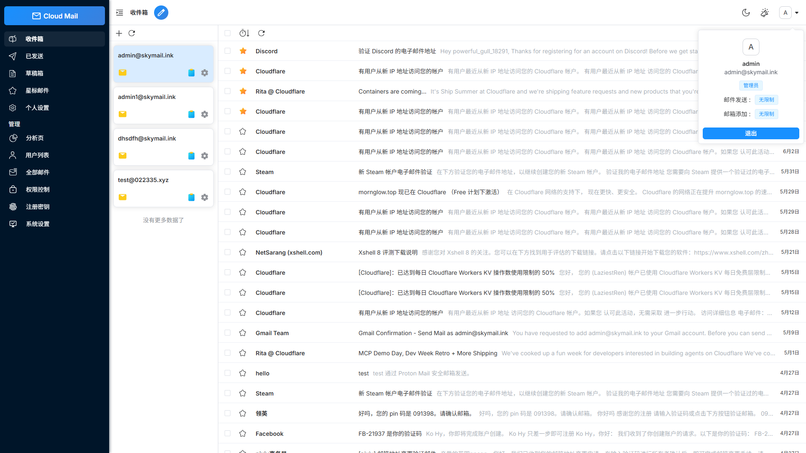
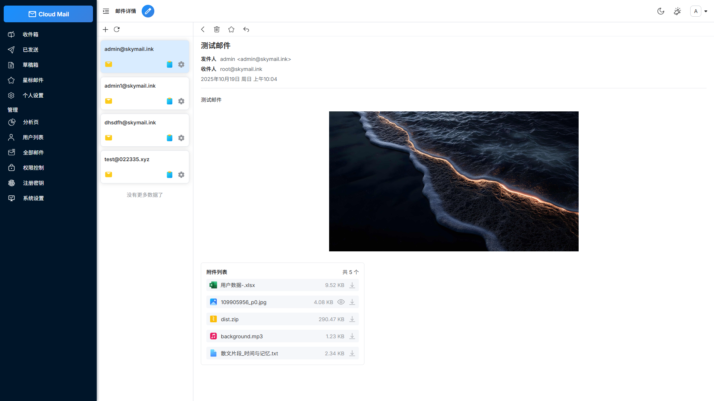
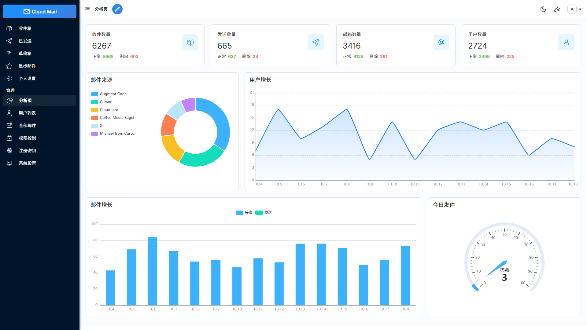
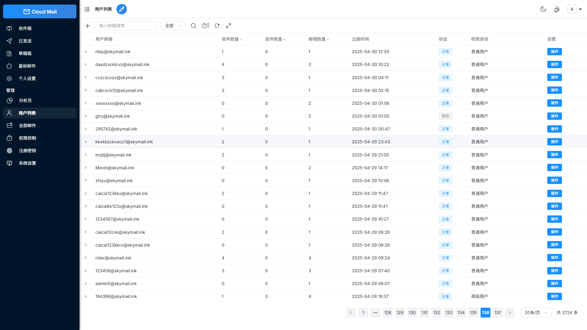

<p align="center">
  
</p>

<h1 align="center">k1lla-mailplus</h1>

<p align="center">
  一个基于 Cloudflare 的 Serverless 邮箱服务，支持多账号管理、邮件收发与附件存储。
</p>

<p align="center">
  <a href="LICENSE"></a>
  
  

<p align="center">
  <strong>中文</strong> | <a href="README-en.md">English</a>
</p>

## 项目简介

k1lla-mailplus 是一个轻量、响应式的邮箱管理系统。只需要一个域名，就可以创建和管理多个邮箱账号，并通过 Cloudflare 的边缘基础设施部署后端服务，降低传统服务器的运维成本。

这个项目适合作为 Serverless 全栈应用的实践案例，覆盖了前后端分离、权限控制、邮件处理、对象存储和数据可视化等常见工程场景。

## 功能特性

- **邮箱账号管理**：创建、管理多个邮箱账号和域名。
- **邮件收发**：支持邮件接收、发送、回复、转发和状态追踪。
- **附件处理**：支持附件上传、接收和下载，文件存储在 Cloudflare R2。
- **管理员控制台**：提供用户、邮件、系统配置和权限管理能力。
- **权限控制**：基于角色的访问控制（RBAC），限制不同用户的功能和资源访问范围。
- **邮件推送**：可将收到的邮件转发到 Telegram 或其他邮箱服务。
- **验证码识别**：结合 Workers AI 自动识别邮件中的验证码。
- **数据可视化**：使用 ECharts 展示用户和邮件等系统数据。
- **安全防护**：集成 Cloudflare Turnstile，降低批量注册和自动化攻击风险。
- **内置垃圾邮件规则**：自动识别上游垃圾邮件标记和临时邮箱域名；命中邮件会进入回收站且不会被转发。
- **可追溯回收站**：回收站会展示邮件进入原因，支持恢复、永久删除和 30 天自动清理。
- **响应式界面**：适配桌面端及主流移动端浏览器。
- **国际化支持**：内置中文和英文界面。
- **开放 API**：支持批量创建用户和按条件查询邮件。

## 技术栈

### 前端

- Vue 3 + Vite
- Element Plus
- Pinia
- Vue Router
- Vue I18n
- ECharts

### 后端与基础设施

- Cloudflare Workers
- Hono
- Drizzle ORM
- Cloudflare D1：关系型数据存储
- Cloudflare KV：缓存和配置存储
- Cloudflare R2：附件和对象存储
- Resend：邮件发送服务
- Workers AI：验证码识别
- Cloudflare Turnstile：人机验证

## 项目结构

```text
k1lla-mailplus/
├── mail-vue/                 # Vue 3 前端应用
│   └── src/
│       ├── components/       # 通用组件
│       ├── layout/            # 页面布局
│       ├── request/           # API 请求层
│       ├── router/            # 路由配置
│       ├── store/             # 全局状态
│       └── views/             # 页面组件
├── mail-worker/              # Cloudflare Workers 后端
│   ├── src/
│   │   ├── api/              # API 接口
│   │   ├── dao/              # 数据访问层
│   │   ├── email/             # 邮件处理
│   │   ├── security/          # 认证与授权
│   │   ├── service/           # 业务服务
│   │   └── index.js           # Worker 入口
│   └── wrangler.toml          # Workers 配置
├── doc/                      # 部署文档（含 GitHub Actions 中/英说明）
└── LICENSE
```

## 本地开发

### 环境要求

在开始之前，请先准备：

| 项目 | 说明 |
| --- | --- |
| Node.js | **18 或更高**（推荐 20 LTS）。在终端执行 `node -v` 可查看版本。 |
| pnpm | 包管理器。未安装时执行：`npm install -g pnpm` |
| Cloudflare 账号 | 免费账号即可。登录 [Cloudflare Dashboard](https://dash.cloudflare.com/) |
| 域名 | **必须**把域名托管到 Cloudflare（Nameserver 指向 Cloudflare），才能收信。 |
| Wrangler CLI | Cloudflare 官方命令行。安装：`npm install -g wrangler`，登录：`wrangler login` |

### 仅本地预览前端（可选）

不连真实 Cloudflare 资源时，也可以先把界面跑起来看效果：

```bash
cd mail-vue
pnpm install
pnpm dev
```

浏览器打开终端提示的地址（一般是 `http://localhost:5173`）。

### 本地启动后端（可选）

```bash
cd mail-worker
pnpm install
pnpm dev
```

本地后端会读取 `mail-worker/wrangler-dev.toml`（以及本机 Wrangler 登录状态）。  
**完整收信 / 登录 / 存邮件** 仍依赖你在 Cloudflare 上创建好的 D1、KV 等资源，并正确填写绑定与变量。新手更建议按下面「构建与部署」直接部署到 Cloudflare，再在网页上使用。

> **安全提醒**：API Token、`jwt_secret`、数据库 ID 等属于敏感信息。**不要**提交到 Git 仓库，也**不要**发到公开群聊或截图外泄。

---

## 构建与部署（面向新手）

下面按「先创建资源 → 再绑定 → 再填变量 → 再部署 → 再初始化」的顺序说明。  
你也可以使用 [GitHub Actions 自动部署](doc/github-action.md)；原理相同，只是把「绑定 / 变量」改成在 GitHub Secrets 里填写。

### 部署前你需要理解的三样东西

| 名称 | 通俗理解 | 本项目用途 | 是否必须 |
| --- | --- | --- | :---: |
| **D1** | Cloudflare 提供的 SQLite 数据库 | 用户、邮件、角色、系统设置等业务数据 | ✅ 必须 |
| **KV** | 键值存储（像简易缓存） | 登录会话、网站配置缓存等 | ✅ 必须 |
| **R2** | 对象存储（类似网盘） | 附件、背景图、PWA 图标等文件 | 推荐（没有附件时也可先不配） |

另外还有两个概念：

- **绑定（binding）**：告诉 Worker「代码里用哪个名字访问资源」。本项目里 **`db` / `kv` / `r2` / `assets` / `ai` 这些名字写死在代码中，不能改成别的**。
- **变量（vars）**：运行时的配置项，例如邮箱域名、管理员邮箱、JWT 密钥。

---

### 第 1 步：在 Cloudflare 创建资源

登录 [Cloudflare Dashboard](https://dash.cloudflare.com/)，选中你的账户。

#### 1.1 创建 D1 数据库

1. 左侧进入 **Workers & Pages** → **D1**（或搜索 “D1”）。
2. 点击 **Create database**。
3. 名称可填：`k1lla-mailplus`（名字可自定义，**重要的是后面的 Database ID**）。
4. 创建完成后打开该数据库，复制并保存：
   - **Database name**（数据库名称）
   - **Database ID**（一长串 UUID，形如 `xxxxxxxx-xxxx-xxxx-xxxx-xxxxxxxxxxxx`）

#### 1.2 创建 KV 命名空间

1. 进入 **Workers & Pages** → **KV**。
2. 点击 **Create a namespace**。
3. 名称可填：`k1lla-mailplus-kv`。
4. 创建后复制并保存：
   - **Namespace ID**（一般是 32 位十六进制字符串）

#### 1.3 （推荐）创建 R2 存储桶

1. 进入 **R2** → **Create bucket**。
2. 桶名需符合规则（小写字母、数字、连字符），例如：`k1lla-mailplus`。
3. 保存 **Bucket name**（注意：R2 绑定用的是**桶名**，不是一串 ID）。

> 若暂时不创建 R2：系统仍可运行，但附件 / 部分图片功能会受限或改用其它存储方式。新手若要完整体验收发附件，建议创建。

#### 1.4 准备域名

1. 在 Cloudflare 添加你的域名，并把域名注册商处的 DNS 服务器改成 Cloudflare 提供的 Nameserver。
2. 等域名显示为 **Active**。
3. 你将在 `domain` 变量里填写这个域名（不要带 `@`），例如：`example.com`。

收信还需在 Cloudflare **Email Routing**（电子邮件路由）里把邮件转到本 Worker（见后文「第 6 步」）。

---

### 第 2 步：把资源绑定到项目（`wrangler.toml`）

打开仓库中的文件：

`mail-worker/wrangler.toml`

仓库默认把 D1 / KV / R2 绑定**注释掉了**，需要你取消注释并填入真实值。  
**请保持 `binding` 字段与下表完全一致**，只改 ID / 名称。

#### 2.1 必填绑定示例

把下面内容中的注释去掉，并改成你自己的值（示例值请勿照抄）：

```toml
[[d1_databases]]
binding = "db"                          # 固定写法，不要改
database_name = "k1lla-mailplus"        # 改成你的 D1 数据库名称
database_id = "xxxxxxxx-xxxx-xxxx-xxxx-xxxxxxxxxxxx"  # 改成你的 D1 Database ID

[[kv_namespaces]]
binding = "kv"                          # 固定写法，不要改
id = "0123456789abcdef0123456789abcdef" # 改成你的 KV Namespace ID

# 可选：需要附件存储时再配置
[[r2_buckets]]
binding = "r2"                          # 固定写法，不要改
bucket_name = "k1lla-mailplus"          # 改成你的 R2 桶名
```

#### 2.2 绑定对照表

| 配置块 | `binding`（不可改） | 你需要填的字段 | 值从哪里来 |
| --- | --- | --- | --- |
| `[[d1_databases]]` | `db` | `database_name`、`database_id` | D1 控制台 |
| `[[kv_namespaces]]` | `kv` | `id` | KV 控制台的 Namespace ID |
| `[[r2_buckets]]`（可选） | `r2` | `bucket_name` | R2 桶的名称 |
| `[assets]` | `assets` | 一般不用改 | 前端构建产物目录，默认 `./dist` |
| `[ai]` | `ai` | 一般不用改 | Workers AI 绑定 |

#### 2.3 常见错误

| 错误现象 | 可能原因 |
| --- | --- |
| 提示 KV / D1 未绑定 | `binding` 名字被改了，或部署时仍是注释状态 |
| 部署成功但接口 502「数据库未绑定」 | `database_id` / KV `id` 填错，或绑到了错误账户 |
| 改了 `binding = "database"` 之类 | **不要改 binding 名**，代码只认 `db`、`kv`、`r2` |

> 使用 GitHub Actions 时：不必手改 `wrangler.toml` 里的 ID，改为在 GitHub Secrets 填写 `D1_DATABASE_ID`、`KV_NAMESPACE_ID`、`R2_BUCKET_NAME` 等，详见 [`doc/github-action.md`](doc/github-action.md)。

---

### 第 3 步：设置运行变量（最重要）

仍在 `mail-worker/wrangler.toml` 的 `[vars]` 段填写。  
变量是**字符串 / 数组配置**，和上面的「资源绑定」不是一回事。

#### 3.1 完整示例（请改成你自己的）

```toml
[vars]
# 可注册、可收信的域名列表（不要带 @）
# 多个域名用逗号分隔写在数组里
domain = ["example.com"]

# 管理员邮箱：必须属于上面 domain 中的某个域名
admin = "admin@example.com"

# JWT 密钥：请自己生成一长串随机字符（建议 32 位以上）
# 用于登录令牌，也用于首次初始化地址 /api/init/<jwt_secret>
# 泄露等于别人可能伪造登录态 / 触发初始化，务必保密
jwt_secret = "请替换成你自己的超长随机字符串"

# 以下为可选
# ai_model = "@cf/meta/llama-3.1-8b-instruct"   # 验证码识别用的 AI 模型，不填则用默认
# analysis_cache = false                        # 是否缓存分析图表数据
# project_link = true                           # 是否显示项目相关链接
# orm_log = false                               # 是否打印 SQL 日志（排错时再开）
```

#### 3.2 变量说明表

| 变量名 | 是否必须 | 类型 / 写法 | 含义 | 正确示例 | 错误示例 |
| --- | :---: | --- | --- | --- | --- |
| `domain` | ✅ | 字符串数组 | 允许注册和收信的域名；**不要写 `@`** | `["example.com"]` | `"@example.com"`、只写 `example.com` 未用数组 |
| `admin` | ✅ | 完整邮箱 | 根管理员账号；必须属于 `domain` 中的域名 | `admin@example.com` | `admin`（缺域名）、`admin@other.com`（不在 domain 内） |
| `jwt_secret` | ✅ | 长随机字符串 | 登录 JWT 签名密钥；初始化 URL 的路径密钥 | 自行生成的随机串 | `123456`、`password`、示例原文 |
| `ai_model` | 可选 | 字符串 | Workers AI 模型名 | `@cf/meta/llama-3.1-8b-instruct` | — |
| `analysis_cache` | 可选 | `true` / `false` | 是否缓存统计图数据 | `false` | — |
| `project_link` | 可选 | `true` / `false` | 界面是否展示项目链接 | `true` | — |

#### 3.3 关于 `domain` 与 `admin` 的对应关系（务必看清）

1. `domain` 只写**主机名**，不带 `@`，不带协议。
2. 多域名示例：`domain = ["example.com", "mail.example.org"]`。
3. `admin` 必须是完整邮箱，且 `@` 后面的域名**必须出现在** `domain` 数组中。  
   - ✅ `domain = ["example.com"]` + `admin = "boss@example.com"`  
   - ❌ `domain = ["example.com"]` + `admin = "boss@gmail.com"`
4. 初始化成功后，只有这个 `admin` 邮箱是根管理员；**公开注册页面不能注册该邮箱**。

#### 3.4 如何生成 `jwt_secret`（任选一种）

- 使用密码管理器 / 随机串生成器，生成 32 位以上随机字符串。  
- 或在终端执行：

```bash
# macOS / Linux
openssl rand -hex 32

# 或 Node.js
node -e "console.log(require('crypto').randomBytes(32).toString('hex'))"
```

把输出整段复制到 `jwt_secret = "..."` 中。

> `wrangler.toml` 里的 `keep_vars = true` 表示：你在 Cloudflare 控制台里改过的变量，在某些更新场景下可能被保留。新手建议统一在 `wrangler.toml`（或 GitHub Secrets）管理，**避免控制台与本地各写一套导致不一致**。

---

### 第 4 步：部署到 Cloudflare

在仓库根目录打开终端，执行：

```bash
# 1）确保已登录 Cloudflare
wrangler login

# 2）进入 Worker 目录并安装依赖
cd mail-worker
pnpm install

# 3）部署（会先构建前端再发布 Worker）
pnpm deploy
```

说明：

- `pnpm deploy` 会执行 `wrangler deploy`，并按配置构建 `mail-vue` 前端到 `mail-worker/dist`。
- 部署成功后，Cloudflare 会给出一个 `*.workers.dev` 地址；你也可以在控制台给 Worker 绑定自定义域名。
- 自定义域名需在 Cloudflare DNS 中可解析到该 Worker（控制台「Workers 自定义域 / 路由」按提示操作即可）。

若使用 GitHub Actions：配置好 Secrets 后，在 Actions 页面手动运行工作流。详见 [`doc/github-action.md`](doc/github-action.md)。

---

### 第 5 步：首次初始化数据库并创建管理员

部署完成后，**用浏览器访问一次**（把域名和密钥换成你的）：

```text
https://你的项目域名/api/init/你的jwt_secret
```

例如：

```text
https://mail.example.com/api/init/a1b2c3d4e5f6...
```

#### 这次访问会做什么？

1. 创建 / 升级数据库表结构（迁移）。
2. 为 `admin` 配置的邮箱创建（或接管）**根管理员**账号。
3. 若是**新创建**管理员，响应 JSON 里会有一次 `temporaryPassword`（临时密码）。

#### 登录步骤

1. **立刻复制并保存** `temporaryPassword`（只在此时完整返回一次）。
2. 打开网站首页，用 **`admin` 邮箱 + 临时密码** 登录。
3. 进入 **个人设置**，马上修改密码。

#### 安全注意

| 注意点 | 说明 |
| --- | --- |
| 初始化地址含密钥 | URL 路径里就是 `jwt_secret`，**不要发到公开地方**，用完不要收藏在公开书签 |
| 首次部署不要自动 init | 若 CI 自动请求 init，临时密码可能只出现在日志里，容易丢或泄露 |
| 再次访问 init | 已是可信管理员时，一般**不会**再给新临时密码，主要用于跑数据库迁移 |
| 改了 `admin` 配置 | 再访问 init 可能接管新邮箱账号并生成新临时密码，旧会话可能失效 |

若页面提示 JWT secret mismatch：说明 URL 里的字符串与当前 Worker 的 `jwt_secret` **不一致**（检查拼写、是否部署了最新配置）。

---

### 第 6 步：配置收信（Email Routing）

没有这一步，系统可以打开登录页，但**收不到外部发来的邮件**。

1. Cloudflare 控制台 → 选中你的域名 → **Email** → **Email Routing**。
2. 启用 Email Routing，按提示添加 DNS 记录（MX 等）。
3. 在路由规则中，把需要接收的地址（或 catch-all）**发送到 Worker**（选择你部署的 k1lla-mailplus Worker）。
4. 确保路由使用的域名已写在 `domain` 变量中。

发信（对外发信）通常还要在系统设置里配置 **Resend** 等发信服务；与收信是两套配置。未配置发信时，一般仍可收信、查看邮件。

---

### 第 7 步：登录后建议完成的设置

使用管理员登录后，打开 **系统设置**，按需配置：

1. 是否开放注册、注册是否需要邀请码（注册码）。
2. Turnstile 人机验证（降低恶意注册 / 撞库）。
3. 发信服务（如 Resend Token）、对象存储域名（R2 自定义域，若使用附件）。
4. Telegram 机器人（可选，用于邮件推送）。
5. 邮件黑名单 / 垃圾规则（可参考下文「内置垃圾邮件规则教程」）。

---

### 第 8 步：升级已有实例

1. 拉取 / 部署新版本代码（本地 `pnpm deploy` 或 GitHub Actions）。
2. 再访问一次：`https://你的项目域名/api/init/你的jwt_secret`  
   用于执行数据库迁移。
3. 已是可信管理员时：通常**不会重置密码**，也不会返回新的临时密码。
4. 仅在以下情况可能接管账号并生成新临时密码：  
   - 旧管理员尚未写入可信标记；或  
   - 你修改了 `admin` 变量指向新邮箱。

---

### 部署方式怎么选？

| 方式 | 适合谁 | 你要做什么 |
| --- | --- | --- |
| 手动：改 `wrangler.toml` + `pnpm deploy` | 新手第一次部署、想看清每一步 | 创建 D1/KV/R2 → 填写绑定与 vars → 部署 → 浏览器 init |
| GitHub Actions | 希望以后推送代码自动部署 | 在 GitHub Secrets 填写同样信息，见 [`doc/github-action.md`](doc/github-action.md) |

两种方式需要的信息是同一套：**D1 ID、KV ID、R2 桶名、domain、admin、jwt_secret**。

---

### 故障排查速查

| 现象 | 排查方向 |
| --- | --- |
| 打开网站空白 / 静态资源 404 | 前端是否构建成功；`[assets]` 是否指向 `./dist` |
| 接口提示 KV / D1 未绑定 | 绑定名是否为 `db`/`kv`；ID 是否填对；是否已重新 deploy |
| 无法注册 / 提示域名不对 | `domain` 是否包含该邮箱域名；是否误加了 `@` |
| 无法登录管理员 | 是否完成 init；临时密码是否抄错；`admin` 是否与登录邮箱完全一致 |
| init 失败 secret mismatch | URL 中的密钥是否等于当前部署的 `jwt_secret` |
| 能登录但收不到信 | Email Routing 是否指向本 Worker；MX 是否生效；收件地址域名是否在 `domain` 中 |
| 附件失败 | 是否绑定 R2；系统设置中 R2 访问域名是否配置 |

## 内置垃圾邮件规则教程

### 判定方式与优先级

系统在邮件入库后、Telegram 和邮箱转发之前执行垃圾邮件判定。只要任一规则命中，邮件会直接移入回收站，不会继续转发。回收站中的邮件会保留 30 天，到期后自动永久清理。

当一封邮件同时匹配多种规则时，回收站只显示一个最明确的原因，优先级如下：

1. **黑名单规则判断**：系统黑名单中的发件人/域名，或用户角色配置的发件人黑名单。
2. **手动规则判断**：系统黑名单中的邮件主题关键词或正文关键词。
3. **规则自动判断垃圾邮件**：邮件头的垃圾评分，或内置临时邮箱域名清单。
4. **最近删除**：用户在邮箱列表、详情页或批量操作中手动移入回收站的邮件。

### 自动规则

自动规则默认启用，无需填写配置：

- 当邮件头 `X-Spam-Flag` 为 `yes`、`true` 或 `1` 时，系统将其视为垃圾邮件。
- 当 `X-Spam-Status` 包含 `yes` 或 `spam`，或者其中的 `score` 大于等于 `required` 时，系统将其视为垃圾邮件。
- 发件人域名会与内置临时邮箱域名清单匹配，子域名也会命中其已收录的父域名。例如，清单中存在 `example-temp.com` 时，`mail.example-temp.com` 也会被识别。

临时邮箱域名清单来源于 [disposable-email-domains/disposable-email-domains](https://github.com/disposable-email-domains/disposable-email-domains)，以 CC0 许可发布，并随 Worker 一起部署，因此收信时不依赖外部网络。

### 配置手动规则和黑名单

1. 使用管理员账号进入 **系统设置**，打开 **邮件黑名单**。
2. 在 **邮件主题** 中添加关键词，命中主题的邮件会显示“手动规则判断”。
3. 在 **邮件内容** 中添加关键词，HTML 正文或纯文本正文命中时会显示“手动规则判断”。
4. 在 **发件人** 中添加完整邮箱地址或域名。命中发件人或发件域名时会显示“黑名单规则判断”。
5. 如需按用户控制，在对应用户角色的发件人限制中添加邮箱、域名或 `*`；命中的邮件同样显示“黑名单规则判断”。

关键词按照原文包含关系匹配。建议使用足够具体的词组，避免用过短、常见的单词造成误判；域名规则不需要添加 `@`。

### 查看、恢复与清理邮件

1. 在侧栏打开 **回收站**，每封邮件主题前会显示进入原因标签。
2. 使用搜索框仅检索已经进入回收站的邮件；常规邮件搜索需要勾选“包含回收站”才会同时返回已删除邮件。
3. 选择单封或多封邮件后可恢复。恢复会将邮件还原到原邮箱，并清除其回收站原因。
4. 永久删除和清空回收站不可恢复。到期前 7 天，回收站会提示即将自动清理的邮件数量。

### 更新临时邮箱域名清单

维护者可在发布 Worker 前执行以下命令，下载上游最新提交并生成新的内置快照：

```bash
pnpm --dir mail-worker update:disposable-domains
```

提交生成的 `mail-worker/src/const/disposable-domains.js` 后，按常规流程构建并部署 Worker。该命令只在开发或 CI 更新时访问 GitHub；线上收信不会访问 GitHub。

### 升级注意事项

本功能新增了回收站原因字段。升级已有实例时，部署新 Worker 后必须再访问一次初始化地址以执行数据库迁移：

```bash
https://你的项目域名/api/init/你的jwt_secret
```

已有回收站邮件会被标记为“最近删除”，新进入回收站的邮件会记录实际命中原因。初始化地址包含密钥，执行后请勿保存、分享或公开。

## 截图

| 邮箱列表 | 邮件详情 |
| :---: | :---: |
|  |  |

| 管理后台 | 系统数据 |
| :---: | :---: |
|  |  |

## 开源协议

本项目使用 [MIT License](LICENSE) 开源。

